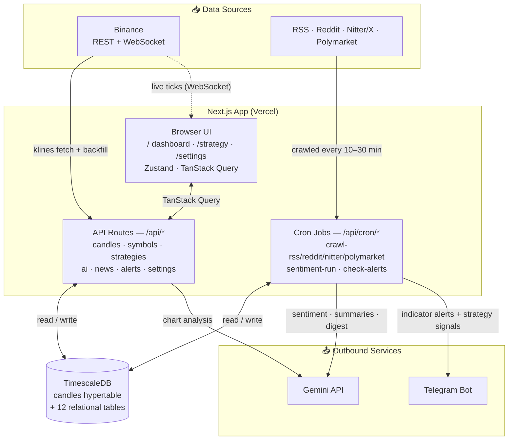

# RMC — Project Overview

> Last updated: 2026-09-17

RMC is a **personal market intelligence dashboard** for crypto (top-20 by volume, fetched dynamically from Binance) and — planned — the Mag7 stocks (AAPL, MSFT, NVDA, GOOGL, AMZN, META, TSLA). It combines real-time prices, candlestick charts, technical indicators, a strategy builder with backtesting, AI chart analysis, a news/sentiment pipeline, and Telegram alerts in one terminal-style interface.

**Strictly paper trading.** No wallets, no private keys, no live order execution — ever.

---

## Current Status

| Phase | Scope                                              | Status        |
|-------|----------------------------------------------------|---------------|
| 1     | Next.js scaffold, Binance data, TimescaleDB, charts + indicators | ✅ Complete |
| 2     | Strategy builder, backtester, signal engine        | ✅ Built      |
| 3     | AI chart analysis                                  | ✅ Built (Gemini) |
| 4     | News/social ingestion + sentiment                  | ✅ Built      |
| 5     | Alerts (Telegram), polish, mobile view             | 🔄 In progress (Telegram alerts working) |

Stock (Mag7) data integration is scaffolded at the type level (`source: 'equities'`) but no provider is wired in yet — crypto via Binance is the live data source today. Locked product plan: [docs/equities-plan.md](equities-plan.md).

---

## Tech Stack

| Layer         | Choice                          |
|---------------|---------------------------------|
| Framework     | Next.js (App Router), React 19, TypeScript (strict) |
| Styling       | Tailwind CSS                    |
| Charts        | Lightweight Charts (candles) + Recharts (equity curves, subcharts) |
| State         | Zustand (client) + TanStack Query (server state) |
| Database      | PostgreSQL + TimescaleDB (Docker), accessed via `pg` — no ORM |
| AI            | Gemini (chart analysis, sentiment) |
| Notifications | Telegram Bot API                |
| Deployment    | Vercel (web + cron) + Docker (DB) |

---

## Feature Areas

### 📈 Dashboard & Charts
- Main dashboard at `/` — multi-pane chart layout: candlestick main chart plus indicator subcharts (RSI, MACD, …)
- Live watchlist driven by the Binance miniTicker WebSocket
- Timeframes from `1m` to `1w`; stale-data banner when the feed is down

### 🧮 Indicators (`src/lib/indicators/`)
37 entries in the `INDICATORS` registry, all implementing a shared `Indicator<P>` interface, so the **same `compute()` function** powers both chart overlays and the backtester:
ADX, Bollinger Bands (+ width, %B), CVD (+ divergence), EMA (+ deviation), MACD, RSI, SMA, Stochastic, StochRSI, time-of-day, volume profile, volume ratio — plus the candlestick / price-action patterns in `src/lib/patterns/` (engulfing, hammer & shooting star, doji stars, abandoned baby, belt hold, breakaway, advance block, three white soldiers, identical three crows, fair value gaps, liquidity sweeps, absorption), which register the same way.

### 🧪 Strategy Builder & Backtester (`/strategy`, `src/lib/strategy/`)
- Visual condition-group builder; strategies stored with **full version history** (`strategies` + `strategy_versions`)
- Backtester with performance metrics and rating
- Live signal evaluation (`strategy_signals`) with Telegram notification on trigger
- Starter templates for common setups

### 🤖 AI Chart Analysis (`/api/ai/chart-analysis`)
- Gemini-powered analysis of the current chart; results persisted in `ai_chart_analysis`

### 📰 News & Sentiment Pipeline (`src/lib/crawlers/`, `src/lib/sentiment/`)
Cron-driven crawlers (see `vercel.json`):
- **RSS** (every 15 min): CoinDesk, CoinTelegraph, Decrypt, The Block, BeInCrypto
- **Reddit** (every 30 min): r/cryptocurrency, r/bitcoin, r/ethtrader, r/CryptoMarkets
- **Nitter/X** (every 20 min): tracked analyst accounts (configured in DB)
- **Polymarket** (every 10 min): prediction-market odds snapshots
- Sentiment scoring runs as its own cron; news feed + digest exposed via `/api/news/*`, manual refresh via `/api/news/refresh`

### 🔔 Alerts (`src/lib/alerts/`, `src/lib/telegram.ts`)
- User-defined alert rules (`alert_rules`) checked by the `check-alerts` cron
- Delivery via Telegram bot; history kept in `alert_history`

### ⚙️ Settings (`/settings`)
- Key/value settings stored in the `settings` table, managed through the UI

---

## High-Level Architecture



- **Solid arrows** = server-side HTTP calls; **dashed** = the one client-side exception, the keyless Binance WebSocket for live ticks
- The `check-alerts` cron evaluates both standalone alert rules **and** strategy signals, then notifies via Telegram

**Key rules:**
- All third-party calls are proxied through `/app/api/*` — API keys never reach the client
- Candles stored in a TimescaleDB hypertable, PK `(symbol, timeframe, open_time)`; `backfill_status` prevents double-fetching
- `volume` is **quote-asset volume** (USDT), not base volume

---

## Database Tables

`symbols` · `candles` (hypertable) · `backfill_status` · `strategies` · `strategy_versions` · `strategy_signals` · `ai_chart_analysis` · `news_articles` · `nitter_accounts` · `polymarket_snapshots` · `alert_rules` · `alert_history` · `settings`

Full schema: [src/lib/db/schema.sql](../src/lib/db/schema.sql)

---

## Getting Started

```bash
docker compose up -d   # TimescaleDB on localhost:5432
pnpm migrate           # apply schema
pnpm dev               # dev server on http://localhost:7070  (note: port 7070, not 3000)
pnpm typecheck         # the only automated check (no eslint yet)
```

See [README.md](../README.md) for the full quick start, environment variables, and gotchas; [SETUP.md](../SETUP.md) for the original Phase 1 walkthrough and [CLAUDE.md](../CLAUDE.md) for code style, conventions, and gotchas. Phase 4 design notes live in [PHASE4_PLAN.md](../PHASE4_PLAN.md).
