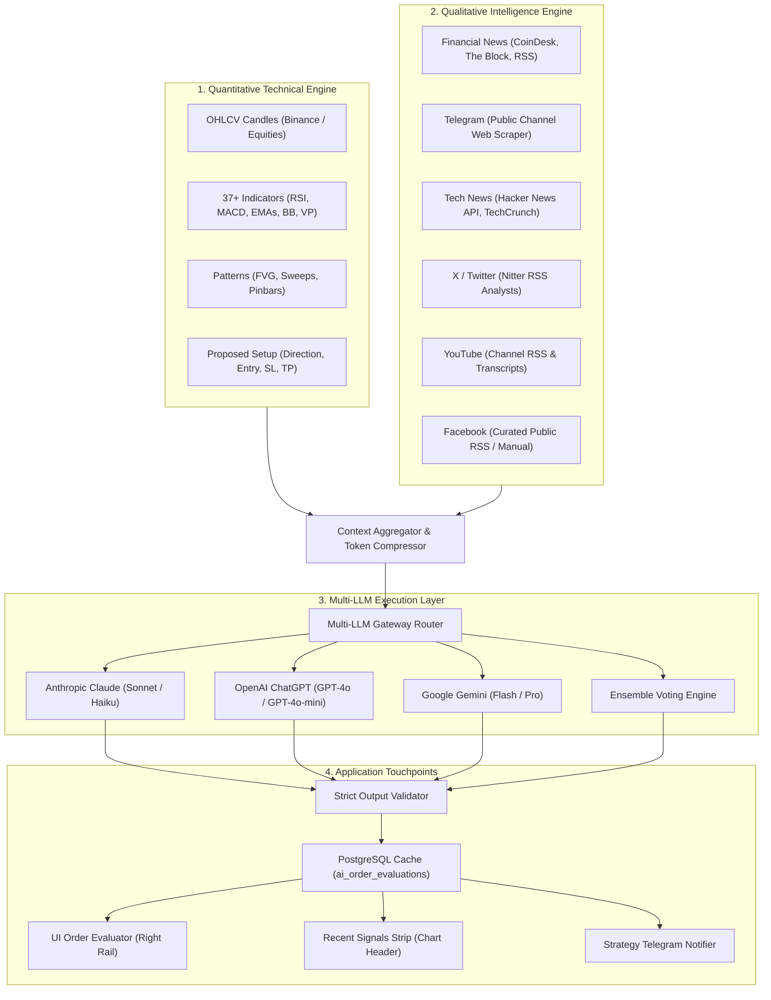

# Plan: AI Order Decision Evaluator (Claude, ChatGPT, Gemini)

> Status: planned — not yet implemented
> Date: 2026-09-23

Synthesize real-time chart OHLCV candles, 37+ technical indicators, price action patterns, and 6 news & social media streams (Financial Newspapers, Telegram, Tech News, X/Twitter, YouTube, Facebook) to evaluate prospective orders / strategy signals. Output a deterministic 3-status verdict: **`PASS`**, **`CAVEAT`** (not sure / proceed with caution), or **`REJECT`**, accompanied by concise, structured explanations.

---

## Decisions Made

| Dimension | Decision |
|---|---|
| **Output Verdicts** | Exactly 3 statuses: `PASS` (high confluence), `CAVEAT` (mixed/cautious/risk event), `REJECT` (high invalidation probability). |
| **Output Format** | Strict JSON schema enforced via native structured outputs / tool calling — zero markdown wrapping or verbose filler. |
| **AI Providers** | Multi-LLM support: **Claude** (Anthropic), **ChatGPT** (OpenAI), **Gemini** (Google), plus an **Ensemble** voting mode. |
| **Technical Context** | Live OHLCV candles, EMA 20/50/200 trend alignment, RSI(14) + divergence, MACD crossovers, Bollinger Bands, Volume Profile (POC/VAH/VAL), and detected price-action patterns (FVG, sweeps, engulfing). |
| **News & Social Channels** | 6 streams: Financial Newspapers (RSS/CryptoPanic), Telegram (`t.me/s/` public channel web scraper), Tech News (Hacker News API + TechCrunch RSS), X/Twitter (Nitter RSS), YouTube (Channel RSS + auto-transcripts), Facebook (public RSS / manual clip). |
| **Storage & Cost Discipline** | Evaluated results cached in Postgres `ai_order_evaluations` keyed by `(symbol, timeframe, direction, candle_close_time, model_provider)` — never burns API credits on duplicate setups. |
| **Application Touchpoints** | 1. Interactive on-demand **Order Evaluator Card** in the chart right rail.<br>2. Automated **Strategy Signal Gatekeeper** (optional Telegram alert tag & auto-filter). |

---

## 1. System Architecture & Data Flow



---

## 2. Ingestion Strategy for the 6 Channels

| Channel | Method | Feasibility & Tradeoffs | Cost & Auth |
|---|---|---|---|
| **1. Financial Newspapers** | Existing `src/lib/crawlers/rss.ts` + CryptoPanic REST API | Fully operational in RMC today (CoinDesk, The Block, Decrypt, BeInCrypto). Expand with Reuters / Yahoo Finance RSS. | Free, zero API key required (or free CryptoPanic tier). |
| **2. Telegram** | Public web preview scraper (`https://t.me/s/<channel>`) | Parses recent messages from top crypto/financial public channels (e.g. Binance Announcements, Whale Alert, news desks). Avoids account bans and bot restrictions. | Free, zero credentials required. |
| **3. Tech News** | Official Hacker News Firebase API + TechCrunch & The Verge RSS | High-signal macro/tech/crypto sentiment. HN Firebase API is fast, official, and unmetered. | Free, zero API key required. |
| **4. X / Twitter** | Nitter RSS (`src/lib/crawlers/nitter.ts`) | Crawls curated analyst accounts (`PlanB`, `woonomic`, `CryptoCred`) configured in `nitter_accounts` table. | Free, avoids $100-$5000/mo X API. |
| **5. YouTube** | Channel RSS feeds (`https://www.youtube.com/feeds/videos.xml?channel_id=...`) | Ingests new video titles & descriptions from tracked macro/crypto analysts in real-time. For tagged coins, pulls free auto-captions/transcripts via timedtext API. | Free, zero API key required. |
| **6. Facebook** | Curated public page RSS mirrors / manual text clipping in UI | Facebook has aggressive login walls and blocks scrapers. Fully automated scraping is brittle; curated RSS mirrors or manual "Paste Context" button is reliable. | Free / manual. |

---

## 3. Strict Output Contract & Prompt Design

### JSON Response Schema
```typescript
export type EvaluationStatus = 'PASS' | 'CAVEAT' | 'REJECT';

export interface OrderEvaluationResult {
  status: EvaluationStatus;
  confidence: 'high' | 'medium' | 'low';
  summary: string; // 1-2 sentence core verdict
  reasons: {
    technical: string;   // Technical indicators / price action confluence or flaw
    sentiment: string;   // News, social media, or macro catalyst
    primaryRisk: string; // Key invalidation point / risk factor
  };
  metrics: {
    technicalScore: number; // 0 to 100
    sentimentScore: number; // -100 to +100
  };
  model: {
    provider: 'claude' | 'chatgpt' | 'gemini' | 'ensemble';
    modelName: string;
    ensembleVotes?: Record<string, { status: EvaluationStatus; reason: string }>;
  };
  evaluatedAt: string; // ISO 8601
}
```

### Prompt Guardrails
- **Persona:** Senior Quantitative Risk Manager & Market Strategist.
- **Rule 1 (Conservative Default):** If technicals and news sentiment conflict, or if market volatility is unpredictable, default to `CAVEAT` rather than `PASS`.
- **Rule 2 (Hard Invalidation):** If entering directly into high-timeframe structural resistance (for Long) or support (for Short), or if major breaking negative news exists, return `REJECT`.
- **Rule 3 (Concise Execution):** Explanations must be punchy and specific (mentioning specific indicators and news events), never generic trading disclaimers.

---

## 4. Database Schema Additions (`src/lib/db/schema.sql`)

```sql
-- ─── AI Order Evaluations Cache ─────────────────────────────────────────────
-- Cache evaluations per bar, direction, and model to prevent burning API credits.
CREATE TABLE IF NOT EXISTS ai_order_evaluations (
  id                UUID PRIMARY KEY DEFAULT gen_random_uuid(),
  symbol            TEXT NOT NULL,
  timeframe         TEXT NOT NULL,
  direction         VARCHAR(10) NOT NULL, -- 'long' | 'short'
  candle_time       TIMESTAMPTZ NOT NULL,
  model_provider    VARCHAR(30) NOT NULL, -- 'claude' | 'chatgpt' | 'gemini' | 'ensemble'
  status            VARCHAR(10) NOT NULL, -- 'PASS' | 'CAVEAT' | 'REJECT'
  evaluation        JSONB NOT NULL,
  created_at        TIMESTAMPTZ NOT NULL DEFAULT NOW(),
  UNIQUE (symbol, timeframe, direction, candle_time, model_provider)
);

CREATE INDEX IF NOT EXISTS ai_order_evaluations_lookup
  ON ai_order_evaluations (symbol, timeframe, direction, candle_time DESC);

-- Enrich strategy signals table with AI evaluation snapshot
ALTER TABLE strategy_signals
  ADD COLUMN IF NOT EXISTS ai_evaluation JSONB;

-- Support telegram / youtube / technews in custom feeds
ALTER TABLE custom_news_feeds
  ADD COLUMN IF NOT EXISTS channel_type VARCHAR(20) NOT NULL DEFAULT 'rss';
```

---

## 5. File Structure & Changes

### New Files to Create:
```
src/
├── lib/
│   ├── ai/
│   │   └── evaluator/
│   │       ├── types.ts            # OrderEvaluationRequest & OrderEvaluationResult types
│   │       ├── prompt.ts           # System instructions & JSON formatting guidelines
│   │       ├── contextBuilder.ts   # Compresses candles, indicators, patterns & news into ~1.2k tokens
│   │       ├── claude.ts           # Anthropic API client (Claude 3.5 Sonnet / Haiku)
│   │       ├── openai.ts           # OpenAI API client (GPT-4o / GPT-4o-mini)
│   │       ├── gemini.ts           # Google Gemini client (Gemini 2.0 Flash)
│   │       └── gateway.ts          # Provider dispatch, ensemble voting, DB caching
│   └── crawlers/
│       ├── telegram.ts             # Public Telegram channel web preview scraper
│       ├── youtube.ts              # YouTube channel RSS parser + transcript fetcher
│       └── technews.ts             # Hacker News Firebase API + tech RSS aggregator
├── app/
│   └── api/
│       └── ai/
│           └── evaluate-order/
│               └── route.ts        # POST /api/ai/evaluate-order handler
└── components/
    └── analysis/
        └── OrderEvaluatorCard.tsx  # Interactive UI card (Long/Short, Model picker, Verdict badge)
```

### Existing Files to Modify:
- [schema.sql](file:///Users/thienkyo/Documents/sourceCode/RMC_crypto/src/lib/db/schema.sql): Add `ai_order_evaluations` and columns.
- [AnalysisPanel.tsx](file:///Users/thienkyo/Documents/sourceCode/RMC_crypto/src/components/analysis/AnalysisPanel.tsx): Add tab or section for **Order Evaluator** alongside Chart Vision Analysis.
- [RecentSignalsStrip.tsx](file:///Users/thienkyo/Documents/sourceCode/RMC_crypto/src/components/chart/RecentSignalsStrip.tsx): Render `PASS` / `CAVEAT` / `REJECT` chip next to signal star ratings.
- [notify.ts](file:///Users/thienkyo/Documents/sourceCode/RMC_crypto/src/lib/strategy/notify.ts): Optionally trigger AI evaluation when a strategy fires a signal.
- [telegram.ts](file:///Users/thienkyo/Documents/sourceCode/RMC_crypto/src/lib/alerts/telegram.ts): Format AI verdict & concise reasoning into the Telegram alert message.

---

## 6. UI / UX Design

### Right Rail "Order Evaluator" Component:
- **Input Controls:**
  - Setup Direction: `[ LONG 🟢 ]` | `[ SHORT 🔴 ]`
  - Model Provider: `Claude 3.5 Sonnet` | `ChatGPT 4o` | `Gemini 2.0 Flash` | `Ensemble (All 3)`
  - Target Entry & Stop Loss: Auto-populated with current market price and active strategy risk rules.
  - Button: **`Evaluate Setup`** (disabled with spinner while running).
- **Verdict Display:**
  - 🟢 **`PASS`** (Emerald badge, glowing border)
  - 🟡 **`CAVEAT`** (Amber badge, warning icon)
  - 🔴 **`REJECT`** (Rose badge, stop icon)
- **Concise Breakdown Cards:**
  - 📊 **Technical Analysis:** e.g. *"RSI(14) oversold bounce at 32.1, but price is 0.8% below declining 200 EMA."*
  - 📰 **Sentiment & News:** e.g. *"Positive spot ETF inflow headlines on Telegram; neutral social volume on X."*
  - ⚠️ **Primary Invalidation Risk:** e.g. *"FOMC rate decision in 4 hours; rejection at $74,200 invalidates setup."*
- **Ensemble Voting Tally (in Ensemble Mode):**
  - Displays Claude (`PASS`), ChatGPT (`PASS`), Gemini (`CAVEAT`) individual votes.

---

## 7. Rollout Phases

1. **Phase A — Service Core & Evaluator Gateway:**
   - Define types, context builder, prompt templates, and clients for Claude, OpenAI, and Gemini.
   - Implement `POST /api/ai/evaluate-order` with Postgres caching.
2. **Phase B — Crawlers Extension (Telegram, YouTube, Tech News):**
   - Implement `src/lib/crawlers/telegram.ts`, `youtube.ts`, and `technews.ts`.
   - Wire them into the cron crawlers and `news_articles` table.
3. **Phase C — Interactive UI (OrderEvaluatorCard):**
   - Build `OrderEvaluatorCard` in the right rail.
   - Test Long/Short evaluations for crypto and equities.
4. **Phase D — Strategy Signal Gatekeeper & Telegram Alerts:**
   - Connect evaluation to live strategy signals in `notify.ts`.
   - Update Telegram alert templates with the AI verdict tag.
