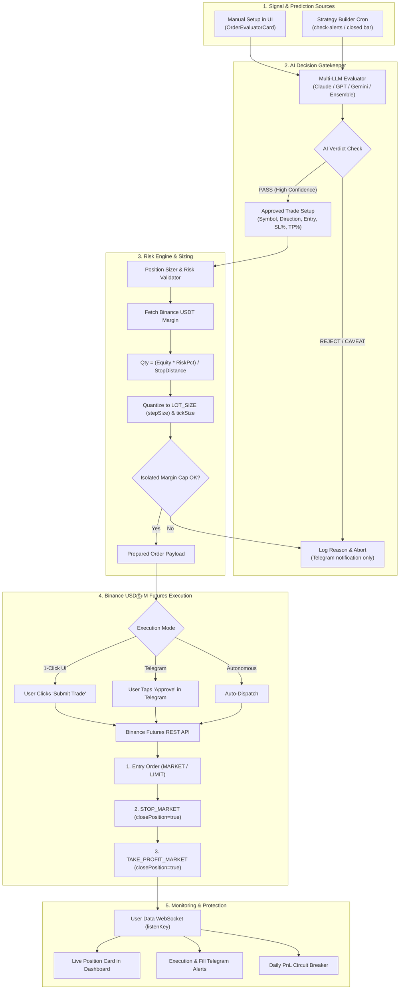

# Plan: Real Binance Futures Trading Engine (Prediction-Driven Execution)

> **Status:** Planned / Architecture & Brainstorming  
> **Date:** 2026-09-26  
> **Goal:** Connect Binance USDⓈ-M Futures API to RMC's multi-LLM prediction engine and strategy signal system, enabling safe, risk-governed live execution with atomic stop-loss/take-profit brackets and testnet-first validation.

---

## 1. Executive Summary & Principles

RMC currently operates strictly as a paper trading intelligence dashboard. This plan specifies the architecture to introduce **real-money USDⓈ-M Perpetual Futures trading on Binance**, utilizing RMC's **AI Order Evaluator (Multi-LLM)** and **Strategy Signal Engine** as the decision core.

### The "Iron Rules" of Execution
1. **Safety First, Profit Second:** Never execute an order without an atomic `STOP_MARKET` order placed immediately upon fill.
2. **Strict Isolated Margin:** Cross margin is prohibited; accounts must never expose general collateral to single-coin liquidation.
3. **No Key Permissions Beyond Trading:** API keys are generated with **Futures Trading Only**—withdrawals must remain strictly disabled.
4. **Testnet-First Certification:** Every order type, sizing calculator, error-handling path, and webhook must execute successfully on `testnet.binancefuture.com` before live credentials are activated.

---

## 2. Binance USDⓈ-M Futures (FAPI) Specification

### 2.1 Environments & Endpoints

| Environment | REST Base URL | WebSocket Stream |
|---|---|---|
| **Production** | `https://fapi.binance.com` | `wss://fstream.binance.com` |
| **Testnet** | `https://testnet.binancefuture.com` | `wss://stream.binancefuture.com` |

### 2.2 Authentication & Cryptography
* **Headers:** `X-MBX-APIKEY: <API_KEY>`
* **Signature:** HMAC-SHA256 hex digest of query string + JSON/URL-encoded payload using `API_SECRET`.
* **Clock Sync & Replay Prevention:** `timestamp = Date.now()` with `recvWindow = 5000`.

### 2.3 Critical Endpoints

```
GET    /fapi/v1/exchangeInfo        -> Symbol rules (stepSize, minQty, tickSize, minNotional)
GET    /fapi/v2/account             -> Available USDT balance, total margin, unrealized PnL
GET    /fapi/v2/positionRisk        -> Active positions, entry price, liquidation price, leverage
POST   /fapi/v1/marginType          -> Enforce 'ISOLATED' margin
POST   /fapi/v1/leverage            -> Configure leverage (e.g. 2x, 3x, 5x)
POST   /fapi/v1/order               -> Place MARKET / LIMIT entry orders
POST   /fapi/v1/order (STOP_MARKET) -> Place atomic Stop Loss (closePosition=true, workingType=MARK_PRICE)
POST   /fapi/v1/order (TP_MARKET)   -> Place Take Profit (closePosition=true, workingType=MARK_PRICE)
DELETE /fapi/v1/order               -> Cancel individual order
DELETE /fapi/v1/allOpenOrders       -> Emergency Kill Switch (wipes all open orders for symbol)
POST   /fapi/v1/listenKey           -> User Data WebSocket stream (fills, margin calls)
```

---

## 3. Decision Matrix: Execution Paradigms

| Feature | Mode 1: 1-Click Assisted (UI) | Mode 2: Telegram Interactive | Mode 3: Autonomous Bot |
|---|---|---|---|
| **User Role** | Reviews AI setup in UI, clicks "Execute" | Receives signal in Telegram, taps "Approve" | Hands-off; bot executes automatically |
| **Latency** | 2–10 seconds (human review) | 3–15 seconds (push to phone) | Sub-second (automated) |
| **Risk of Runaway Bot** | **Zero** | **Near Zero** | Requires strict circuit breakers |
| **Recommended Phase** | **Launch Phase (P1)** | **Expansion (P2)** | **Maturity (P3)** |

**Decision:** We will build the foundation so that **Mode 1 (1-Click UI Execution)** is available immediately, with the exact same execution service powering **Mode 2** and **Mode 3**.

---

## 4. System Architecture & Flow



---

## 5. Risk Management & Protective Guardrails

### 5.1 Dynamic Position Sizing Formula
To prevent blowing up an account, position sizes are strictly derived from **risk budget**, not arbitrary dollar guesses:

$$\text{Dollar Risk} = \text{Account Equity} \times \text{Risk Percentage (e.g. 1.0\%)}$$

$$\text{Stop Distance} = |\text{Entry Price} - \text{Stop Loss Price}|$$

$$\text{Position Quantity (Coins)} = \frac{\text{Dollar Risk}}{\text{Stop Distance}}$$

*The computed quantity is then snapped to the symbol's `stepSize` and verified against `minQty` and `minNotional`.*

### 5.2 Mandatory Protective Guardrails
1. **Isolated Margin Lock:** Every trade submission begins with `POST /fapi/v1/marginType` (`ISOLATED`).
2. **Leverage Ceiling:** Default `3x`, hard cap `5x`. (High leverage like 20x–100x is permanently disallowed in code).
3. **Atomic Bracket Failure Handler:** If the Entry order fills but the `STOP_MARKET` order fails (e.g. invalid price error or network timeout), the engine **immediately dispatches a market order to close the entry position** and sounds an emergency alert.
4. **Daily Circuit Breaker:** If cumulative daily realized + unrealized drawdown exceeds **5% of total account equity**, all trading halts automatically for 24 hours.
5. **Emergency Kill-Switch (Panic Button):**
   * Accessible via UI button and Telegram command (`/panic`).
   * Instantly cancels all open orders across all symbols and submits reduce-only market orders to flatten open positions.

---

## 6. Implementation Components & Files

### Component 1: Binance Futures API Client (`src/lib/exchange/binanceFutures.ts`)
* Implements HMAC-SHA256 signature generator using Node's `crypto` module.
* Reads `.env.local` configuration:
  * `BINANCE_FUTURES_API_KEY`
  * `BINANCE_FUTURES_API_SECRET`
  * `BINANCE_FUTURES_TESTNET` (`true` / `false`)
* Methods:
  * `getFuturesAccount()`: Balances, available margin.
  * `getPositionRisk(symbol?)`: Open positions, liquidation prices, unrealized PnL.
  * `getExchangeInfo(symbol)`: Precision, lot size, min notional.
  * `setMarginType(symbol, 'ISOLATED')` & `setLeverage(symbol, leverage)`.
  * `placeOrder(params)`: Market / Limit / Stop Market / Take Profit.
  * `cancelAllOpenOrders(symbol)`.
  * `closePositionMarket(symbol)`.

### Component 2: Risk & Sizing Engine (`src/lib/trading/riskEngine.ts`)
* Quantizes prices and quantities to exchange filters.
* Computes exact position size based on risk percentage and stop-loss distance.
* Validates daily drawdown and circuit breaker status.

### Component 3: Order Execution Service (`src/lib/trading/executor.ts`)
* Coordinates the multi-step atomic order execution:
  1. Set Isolated Margin & Leverage.
  2. Send Entry Order.
  3. Send Bracket Stop Loss (`STOP_MARKET`, `workingType: MARK_PRICE`, `closePosition: true`).
  4. Send Bracket Take Profit (`TAKE_PROFIT_MARKET`, `workingType: MARK_PRICE`, `closePosition: true`).
* Logs trade records to database table `live_trades`.

### Component 4: Database Schema Additions (`src/lib/db/schema.sql`)
```sql
-- ── Live Futures Trades ──────────────────────────────────────────────────
CREATE TABLE IF NOT EXISTS live_trades (
  id                  UUID PRIMARY KEY DEFAULT gen_random_uuid(),
  symbol              VARCHAR(20) NOT NULL,
  direction           VARCHAR(10) NOT NULL,         -- 'long' | 'short'
  entry_price         FLOAT NOT NULL,
  exit_price          FLOAT,
  quantity            FLOAT NOT NULL,
  leverage            INT NOT NULL DEFAULT 3,
  stop_loss_price     FLOAT NOT NULL,
  take_profit_price   FLOAT,
  status              VARCHAR(20) NOT NULL,         -- 'open' | 'closed' | 'cancelled' | 'stopped_out' | 'take_profit'
  realized_pnl        FLOAT,
  entry_order_id      VARCHAR(50),
  sl_order_id         VARCHAR(50),
  tp_order_id         VARCHAR(50),
  execution_mode      VARCHAR(20) NOT NULL,         -- 'manual_1click' | 'telegram' | 'autonomous'
  ai_evaluation_id    UUID REFERENCES ai_order_evaluations(id),
  created_at          TIMESTAMPTZ NOT NULL DEFAULT NOW(),
  closed_at           TIMESTAMPTZ
);
CREATE INDEX IF NOT EXISTS idx_live_trades_status ON live_trades (status);
```

### Component 5: UI Trading & Position Bar
* **Chart Header Widget:** Live account balance, available margin, and total unrealized PnL.
* **OrderEvaluatorCard Upgrade:** 
  * Displays "⚡ Execute on Binance Futures" button when verdict is `PASS`.
  * Modal shows pre-calculated sizing, leverage, max dollar risk, SL price, and TP price.
  * Single-click confirmation dispatches `/api/trading/execute`.
* **Open Positions Strip:** Shows live open positions with Mark Price, PnL %, Liquidation Price, and a "Market Close" button.

---

## 7. Phased Rollout Plan

```
Phase 1: Foundation & Testnet Validation (Zero Financial Risk)
  ├── Step 1.1: Create Binance Futures client with HMAC-SHA256 signing
  ├── Step 1.2: Add Testnet credentials to .env.local
  ├── Step 1.3: Verify GET /fapi/v2/account, GET /fapi/v1/exchangeInfo, and GET /fapi/v2/positionRisk
  └── Step 1.4: Unit & integration tests for lot sizing and precision math

Phase 2: Bracket Order Execution on Testnet
  ├── Step 2.1: Implement atomic bracket execution (Market Entry + SL + TP)
  ├── Step 2.2: Implement Kill-Switch endpoint (cancel orders + flatten positions)
  └── Step 2.3: Verify fills and bracket triggers on Binance Futures Testnet

Phase 3: UI Dashboard Controls (1-Click Execution)
  ├── Step 3.1: Add Live Account & Position bar to Dashboard
  ├── Step 3.2: Add "Execute Binance Order" modal in OrderEvaluatorCard
  └── Step 3.3: Visual SL/TP levels on Lightweight Charts

Phase 4: AI Prediction Pipeline Integration
  ├── Step 4.1: Connect AI Evaluator PASS outputs directly to execution payload
  ├── Step 4.2: Telegram interactive alert approval buttons (Mode 2)
  └── Step 4.3: Implement autonomous execution rules with circuit breaker (Mode 3)

Phase 5: Production Deployment & Micro-Capital Pilot
  ├── Step 5.1: Configure real Binance API keys (Futures only, IP whitelisted)
  ├── Step 5.2: Pilot with micro-sizing ($10–$25 risk per trade)
  └── Step 5.3: Monitor execution logs, slippage, and funding rate impact
```
